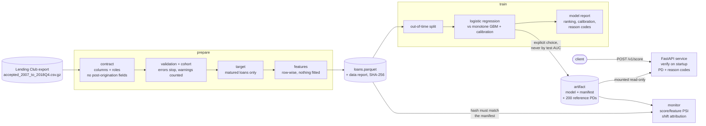

# Credit Risk Intelligence

[](https://github.com/Oussama-zbir/credit-risk-intelligence/actions/workflows/ci.yml)
[](pyproject.toml)
[](pyproject.toml)
[](LICENSE)

Probability-of-default modelling on public Lending Club data, built the way a
lender would need it: a leakage-audited feature contract, an honest default
definition, out-of-time validation, a logistic-regression baseline and
calibrated gradient boosting measured against it, exact model reason codes and a
versioned model artifact served over HTTP, and drift monitoring against the
model's own training window.

Every stage has been run on the full 2.26M-row Lending Club file; the numbers
below are from that run, not from a sample.

---

## What this demonstrates

| | |
| --- | --- |
| **Leakage control** | Every source column is declared with a role in [`contract.py`](src/credit_risk/data/contract.py); post-origination columns (payments, recoveries, settlements) are never loaded. Lending Club's own grade and rate are an opt-in group, so their uplift is measured rather than hidden. |
| **An honest label** | A loan is labelled only once its full term has elapsed by the snapshot, so recent vintages are not dominated by early defaulters. |
| **Out-of-time validation** | Train on earlier vintages, test on a strictly later window. The champion was chosen on 2012 and frozen before 2013 was scored. |
| **Baseline before model** | A regularised logistic regression with every preprocessing statistic fitted on train only, against a monotone-constrained gradient booster. The baseline won, and the README says so. |
| **Calibration** | Ranking (AUC, Gini, KS) reported apart from probability quality (Brier, log loss, reliability by decile); Platt or isotonic fitted on a later slice of the training window, never on test. |
| **Explainability** | Exact additive log-odds contributions for both families: training-centred terms for the logistic regression, TreeSHAP implemented over the fitted trees for the booster, each checked for additivity at runtime and against brute-force Shapley values in tests. |
| **Self-verifying artifact** | Manifest with data hash, windows, scores and library versions; on load the model hash, the scikit-learn version and 200 reference PDs (to 1e-9) must match, or nothing is served. |
| **Serving** | FastAPI service: PD and up to four reason codes per applicant, a request schema tied to the feature contract, unseen categorical levels scored and logged as drift. |
| **Container** | Non-root image with a read-only root filesystem; the model is mounted, not baked; training and serving share pinned versions; a tampered artifact makes the container exit. Checked in CI. |
| **Drift monitoring** | Score and feature PSI on frozen reference bins with separate `missing` and `unseen` bins, plus each feature's exact share of the shift in mean log-odds. |
| **Testing** | 255 tests on synthetic rows shaped like the real export; no download needed. Ruff, `mypy --strict`, a 3.12/3.13 matrix and a container smoke test in CI. |

## Architecture



## Results

776,277 matured, labelled loans (15.15% default). The champion was chosen on a
2012 development window and frozen before 2013 was scored; applicant features
only, as deployed:

| 2013 out of time, 134,804 loans | AUC | Gini | KS | Brier | log loss | calib. error |
| --- | --- | --- | --- | --- | --- | --- |
| **logistic regression (champion)** | **0.6744** | **0.3489** | **0.2533** | **0.1254** | **0.4089** | 1.91% |
| gradient boosting + Platt | 0.6717 | 0.3434 | 0.2474 | 0.1254 | 0.4090 | **1.41%** |

- The regularised logistic regression beat the monotone-constrained booster
  out of time in both windows; the booster lost 0.08 AUC from train to test,
  the baseline 0.03.
- Adding Lending Club's own grade and interest rate added +0.001 (2012) and
  +0.011 (2013) AUC to the baseline: the applicant features already recover
  most of the lender's scorecard.
- With a stable 2013 default rate (15.6%), the champion over-predicted in
  every decile (mean PD 17.5%): a calibration shift a default-rate chart would miss.
- Drift monitoring traces that shift to its inputs: lower FICO scores account
  for 68% of the rise in mean log-odds. The score PSI (0.067) stayed under the
  usual 0.10 alarm while the model was 2 points off.

Protocol, the 2012 development table, reproduction commands and caveats are
in [`docs/RESULTS.md`](docs/RESULTS.md); the generated reports are in
[`docs/results/`](docs/results/).

## Why the data layer comes first

It is easy to get a near-perfect AUC on this dataset, and the number means
nothing: it comes from two mistakes this repository is built to prevent.

1. **Target leakage.** The file includes columns written *after* a loan was
   issued. `recoveries` is non-zero only for charged-off loans; a model that
   sees it is reading the label.
2. **Right-censored labels.** Dropping loans still `Current` leaves recent
   vintages dominated by early defaulters and prepayers.

The reasoning behind each choice — dataset selection, default definition,
observation window, leakage audit — is in [`docs/DATA.md`](docs/DATA.md).

## Usage

```bash
python -m venv .venv && source .venv/bin/activate
pip install -e ".[service]" -c constraints.txt   # the pins the image serves with
```

Download `accepted_2007_to_2018Q4.csv.gz` from the
[Lending Club dataset on Kaggle](https://www.kaggle.com/datasets/wordsforthewise/lending-club)
into `data/` (git-ignored), then:

```bash
# 1. raw export -> data/processed/loans.parquet + data_report.md  (~18 min)
python -m credit_risk.prepare data/accepted_2007_to_2018Q4.csv.gz

# 2. compare models out of time -> model_report.md, and save the chosen one
python -m credit_risk.train data/processed/loans.parquet \
    --train 2010-01:2012-12 --test 2013-01:2013-12 \
    --artifact-dir artifacts --artifact-model logistic-regression

# 3. serve it
CREDIT_RISK_ARTIFACT_DIR=artifacts/<model_id> \
    uvicorn --factory credit_risk.service:app_from_env

# 4. monitor a later window against its training window -> drift_report.md
python -m credit_risk.monitor artifacts/<model_id> data/processed/loans.parquet \
    --window 2013-01:2013-12
```

Windows are required arguments, because which vintages are mature depends on
the snapshot; the data report shows it. `--artifact-model` is always explicit:
a model chosen by its own test window would make that window a selection set.

### Scoring service

| endpoint | returns |
| --- | --- |
| `GET /health` | `ok` and the loaded `model_id` |
| `GET /v1/model` | family, features, dropped features, provenance, out-of-time test scores |
| `POST /v1/score` | per application (1–100): PD, up to 4 reason codes, unseen categorical levels |

```bash
curl -s localhost:8000/v1/score -H 'content-type: application/json' -d '{"applications": [{
  "loan_amnt": 15000, "term_months": 60, "purpose": "small_business",
  "application_type": "Individual", "annual_inc": 42000,
  "verification_status": "Not Verified", "home_ownership": "RENT", "fico": 662,
  "credit_history_months": 50, "delinq_2yrs": 1, "open_acc": 6, "total_acc": 12,
  "pub_rec": 0, "revol_bal": 9000, "dti": 31.5, "revol_util": 88,
  "inq_last_6mths": 3}]}'
```

Every response carries `model_id` and `model_family`, so a decision can be
traced back to its manifest. If the artifact fails any check, uvicorn exits
before it binds.

### Container

```bash
docker build -t credit-risk-service .
docker run -p 8000:8000 --read-only --tmpfs /tmp \
    -v "$PWD/artifacts/<model_id>:/artifact:ro" credit-risk-service
```

The image installs from `constraints.txt`: an artifact refuses to load under a
scikit-learn other than the one that saved it, so train with the same pins.
Artifacts saved before `save_artifact` set the directory to 0755 are 0700,
which the image's non-root user cannot read on Linux; `chmod 755` them once.

## Layout

```
src/credit_risk/data/
  contract.py     every column, its role, and why
  cohort.py       modelling population: drops pre-2011 loans outside the credit policy, counted
  validation.py   ingestion checks: errors stop the pipeline, warnings are counted
  target.py       default definition + maturity window, with a LabelReport
  split.py        out-of-time split between issue-date windows
  loader.py       reads contract columns only; snapshot from the file itself
  features.py     row-wise typed features: nothing fitted, so no split leakage
  report.py       population, vintages, warnings and missingness as Markdown
src/credit_risk/models/
  baseline.py     logistic regression; every preprocessing statistic fitted on train only
  boosting.py     monotone-constrained gradient boosting, early-stopped on a later slice
  calibration.py  Platt / isotonic recalibration fitted on that slice, never on test
  degenerate.py   features with no variation in a model's fitting rows, left out of that model
  metrics.py      AUC, Gini, KS (ranking); Brier, log loss, reliability bins (probabilities)
  explain.py      exact log-odds contributions (training-centred for LR, TreeSHAP for GBM)
  artifact.py     versioned model (either family) on disk: manifest, hash, reference-PD checks
  drift.py        PSI on bins frozen from the reference window; missing and unseen kept apart
src/credit_risk/prepare.py   raw export -> data/processed/loans.parquet + data_report.md
src/credit_risk/train.py     out-of-time fit + comparison -> model_report.md
src/credit_risk/service.py   FastAPI: PD + reason codes from one verified artifact
src/credit_risk/monitor.py   artifact vs a later window: score/feature PSI, shift attribution
Dockerfile                   the service; the artifact is mounted read-only at /artifact
constraints.txt              runtime pins shared by training and the image
scripts/container_smoke.sh   image check: serve a synthetic artifact, refuse a tampered one
```

## Testing and quality

```bash
pip install -e ".[dev]"
ruff check . && ruff format --check . && mypy && pytest
```

Tests use synthetic rows shaped like the Lending Club export (including its
`'13.56%'` and `' 36 months'` string formats), so no data download is needed.
CI runs the suite on Python 3.12 and 3.13 without pins, so upstream releases
are still tested, and a container job runs
[`scripts/container_smoke.sh`](scripts/container_smoke.sh): it trains a
synthetic artifact with the pins, serves it from the image, then requires a
copy with a tampered `model.pkl` to stop the container.

## Documentation

| | |
| --- | --- |
| **[docs/DATA.md](docs/DATA.md)** | Dataset choice, modelling cohort, default definition, observation window, the column-by-column leakage audit, ingestion checks and features. |
| **[docs/DESIGN.md](docs/DESIGN.md)** | The reasoning behind the models, calibration, both explanation methods, the artifact format and its load-time checks, the service, the container and the drift report. |
| **[docs/RESULTS.md](docs/RESULTS.md)** | Protocol, both out-of-time tables, findings, drift on 2013, exact reproduction commands and library versions. |

## Limitations

Stated plainly, because the edges of a credit model are part of its design.

- **Accepted loans only.** Lending Club published the loans it approved, so
  there is no reject inference and performance on the full applicant
  population is unknown. Income is largely self-reported.
- **One development and one confirmation window.** No confidence intervals or
  rolling-origin evaluation, so the 0.003 AUC gap between the two models is not
  by itself evidence that one ranks better. The booster was not tuned beyond
  early stopping.
- **Only 2013 is monitored for drift.** The public file holds matured loans
  only, and later vintages lose their 60-month loans by construction, so they
  are not comparable windows.
- **Reason codes are model explanations, not a compliant adverse-action
  notice.** No regulatory mapping of features to reason statements, and no
  fairness testing beyond keeping protected-attribute proxies out of the
  feature set.
- **The artifact hash detects corruption, not tampering.** Unpickling runs
  code, so artifacts must come from a store only training writes; there is no
  signing.
- **The service is a scoring core, not a lending system.** No authentication,
  no rate limiting, no persistence of decisions, and logs are plain text rather
  than structured. Drift is a batch report, not a live dashboard or alert.
- **No retraining loop.** Drift is measured and attributed; deciding to
  recalibrate or retrain, and promoting a new artifact, is left to a person.

## License

[MIT](LICENSE)
